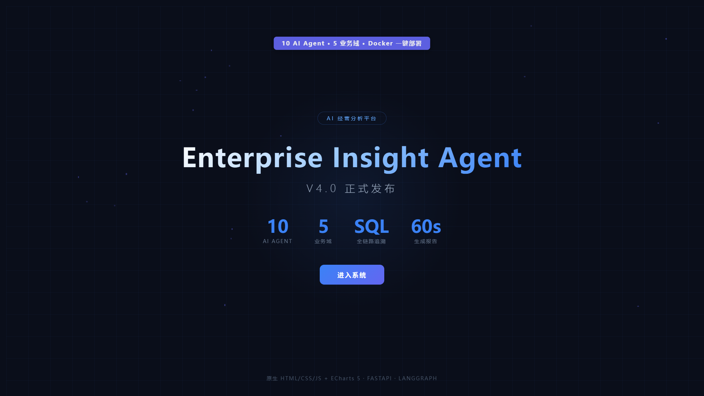

# 高志远 · AI 产品作品集

> Enterprise Insight Agent V4 — 面向连锁零售的 Multi-Agent 经营分析平台
> 
> 角色：独立产品负责人（产品设计 / 架构决策 / 评估体系）
> 
> 周期：2025.06 - 2026.06 | 版本：V1 → V2 → V3 → V4 四版迭代
> 
> 代码开源：[github.com/ZhiyuanGAO0920/enterprise-insight-agent](https://github.com/ZhiyuanGAO0920/enterprise-insight-agent)

---

## 1. 产品定位

让连锁零售管理者用**自然语言提问**，60 秒内获得含数据概览、根因诊断、可执行建议的经营分析报告。

```
传统方式：导出 Excel → 手工透视表 → 写报告（半天）
V4 方式：  用中文提问 → AI 自动分析 → 报告输出（60 秒）
```

**目标用户**：连锁零售企业的老板、区域经理、门店店长

---

## 2. 产品界面

### 欢迎页


### 经营看板（登录首页）
登录后默认进入看板——6 个 KPI 卡片带环比箭头、30 天趋势折线图、区域占比环形图、门店销售额 Top 10 + 退款率 Top 10。
!字布设置图片宽度为 100% 下方默认居中显示与上图相同
新增环比小箭头方向根据数据自动判断上升下降
将门店排名表格替换为退款率 Top 10
看板数据时效指示器
• sidebar 导航上新增历史记录、系统管理 Tab
• 右上角用户菜单集成角色信息、反馈历史、账户操作

### 分析对话
左侧 5 个导航 Tab，右上角用户菜单含角色信息、反馈历史、账户操作。
!字布设置图片宽度为 100% 下方默认居中显示与上图相同
账户操作从侧边栏底部移至 Header 右上角“[a admin ▾]”下拉菜单

### 查询型分析
输入“各门店销售额排名”——输出排名表格 + 柱状图 + Supervisor 规划面板，查询型问题追求效率。
!字布设置图片宽度为 100% 下方默认居中显示与上图相同
向导航中添加用户反馈历史、系统管理、账户切换

### 历史记录
独立 Tab，支持搜索、分页、状态筛选（通过/需审查），卡片式布局。
!字布设置图片宽度为 100% 下方默认居中显示与上图相同
历史记录从侧边栏拆出为独立页，支持分页浏览

### AI 质量监控
5 大核心指标：Reflection 通过率、延迟、Token 成本、Agent 健康度、错误日志。
!字布设置图片宽度为 100% 下方默认居中显示与上图相同
补全成本指标、表头、Token 消耗趋势

### 数据源头 & 用户反馈
每条结论可追溯至原始 SQL 及 Supervisor 推理过程，报告底部提供 👍👎 反馈按钮。
!字布设置图片宽度为 100% 下方默认居中显示与上图相同
反馈提交后展示平台好评率，新增“我的反馈”历史查看
## 3. 核心架构

### Agent 协作流程（11 节点）

```
用户提问："华东区销售为什么下降？"
        ↓
    Supervisor（规划路由）
        ↓ Send 并行扇出
┌───────┬───────┬───────┬──────────┬──────────────┐
│ Sales │  CRM  │Finance│Inventory │Supply Chain  │
│ Agent │ Agent │ Agent │  Agent   │    Agent     │
└───────┴───────┴───────┴──────────┴──────────────┘
        ↓ 扇入
    Aggregator（聚合，纯 Python，不耗 Token）
        ↓
    Chart Advisor（推荐图表类型）
        ↓
    Report Agent（流式生成报告，逐字推前端）
        ↓
    Reflection Agent（4 维质检，不合格重写 1 次）
        ↓
    Save Memory（pgvector 向量存储）
```

**5 个业务域 Agent**：销售 / 会员 / 财务 / 库存 / 供应链

---

## 4. 关键产品决策

### 为什么用 10 个 Agent 而不是 1 个？

三个具体原因，实测验证：

1. **上下文竞争**：5 个领域 Schema 超 3000 token，长上下文后半段注意力衰减。通过三个对照实验验证——审计 SQL → 隔离上下文 → 位置效应测试
2. **故障隔离**：CRM Agent 挂了不污染 Sales/Finance，Aggregator 跳过而非编造
3. **迭代效率**：Sales Prompt 迭代 7 版、CRM 只改 2 版——独立 Prompt，改一个不需重测全部

### Reflection 为什么最多重试 1 次？

| 重试 | 修复率 | 额外 Token | 判断 |
|------|:-----:|-----------|------|
| 0 次 | — | 0 | 25% 报告有质量问题 |
| 1 次 | ~60% | 3000-5000 | **最优** |
| 2 次 | ~75% | 6000-10000 | 边际递减 |
| 3 次 | <80% | 9000-15000 | 越改越差 |

### 客户 Schema 三层适配器

```
Schema 自动发现（系统自动）→ YAML 语义映射（客户技术人员一次性）→ Prompt 动态生成（系统自动）
```

只有第二层需要人工介入。年费 3-5 万的定价下，派工程师驻场的成本会让毛利率变负。"零驻场部署"是商业模式的必要条件。

---

## 5. 安全设计

### 行级安全（RLS）

- SQL 注入层：`inject_store_filter` 在最外层 WHERE 自动注入 `store_id IN (...)`
- Prompt 注入层：System Prompt 追加权限限制描述
- 实际发现并修复 3 个安全漏洞（zhangsan 越权查看全部门店数据）

### 数据溯源

每条分析结论可点击"查看 SQL"追溯原始查询——执行耗时、返回行数全记录。**不承诺 100% 准确，承诺 100% 可追溯。**

### 信任分级

每份报告底部三层标注：✅ 数据层（直查数据库）→ ⚠️ 分析层（AI 推理）→ 💡 建议层（需人工复核）

---

## 6. AI 质量评估体系

三层评估，BadCase 驱动迭代：

| 层 | 方式 | 规模 |
|----|------|------|
| 离线评估集 | 102 条标准问题（50 查询 + 38 分析 + 14 边界），覆盖 5 领域 + 综合 + 边界 | 每次 Prompt 修改后跑 |
| Reflection 在线质检 | 4 维度（一致性/逻辑/可操作/完整） | 每次分析自动运行 |
| 用户反馈 | 👍👎 + 反馈文字 | 持续收集 |

Reflection 的 4 个维度中 2 个来自 BadCase 复盘——"逻辑严谨性"因虚假因果推断催生，"建议可操作性"因空泛建议催生。

---

## 7. 版本演进

| 版本 | Agent | 关键能力 | 状态 |
|------|:-----:|---------|:----:|
| V1 | 线性流水线 | Planner → SQL Generator → Analyzer → Reflection | 概念验证 |
| V2 | 3 Agent | Multi-Agent 并行（LangGraph Send） | 架构验证 |
| V3 | 8 Agent | 多轮对话 + 图表 + 库存/供应链 | 体验闭环 |
| V4 | 11 节点 | 看板 + 流式 + 安全 + 多租户 + 通知 | 企业就绪 |


*V2：直接进聊天页，无看板，无流式*

*V3：有图表有对话，仍无看板*

*V4：欢迎页 → 看板 → 流式进度 → 溯源 → 反馈*

---

## 8. 项目数据

| 指标 | 数值 |
|------|------|
| Python 代码 | ~10,000 行 |
| 前端代码 | ~1,900 行（原生 HTML/CSS/JS） |
| Agent 节点 | 11 |
| API 端点 | 46 |
| 测试用例 | 192 条 |
| ORM 模型 | 17 |
| Alembic 迁移 | 12 版 |
| Demo 数据 | 100 门店 / 50,925 订单 / 5,000 会员 |
| 文档 | 18 个 Markdown |
| Bug 修复 | 15 条（含 3 个安全漏洞） |

---

## 9. 技术栈

| 层 | 技术 |
|----|------|
| Agent 编排 | LangGraph StateGraph + Send 并行扇出 |
| LLM | DeepSeek-V4（路由/分析/报告）+ BGE-M3 本地 Embedding |
| 后端 | FastAPI + SSE 流式 + PostgreSQL 16 + pgvector + Redis 7 |
| 前端 | 原生 HTML/CSS/JS 1903 行 + ECharts 5 |
| 部署 | Docker Compose 5 容器 + n8n 定时调度 |
| 通知 | 飞书 interactive card / 钉钉 markdown / 企微 markdown |

---

## 10. 方法论沉淀

- **13 条关键产品决策记录**：每条含"为什么选这个方案""如果重来会怎么选"
- **7 条 AI 产品设计原则**：够好就行、灰度开关、输出自适应、数据诚实、防御性设计、BadCase 驱动、边界告知
- **3 次 BadCase 闭环复盘**：退款率张冠李戴、虚假因果推断、行级安全数据泄露——每条含问题→诊断→实验→修复→教训

---

> **在线演示**：[GitHub 仓库](https://github.com/ZhiyuanGAO0920/enterprise-insight-agent) | Docker 一键部署 `./deploy.sh`
>
> **联系**：17621845921 | 779157871@qq.com
>
> *最后更新：2026-06-16*
